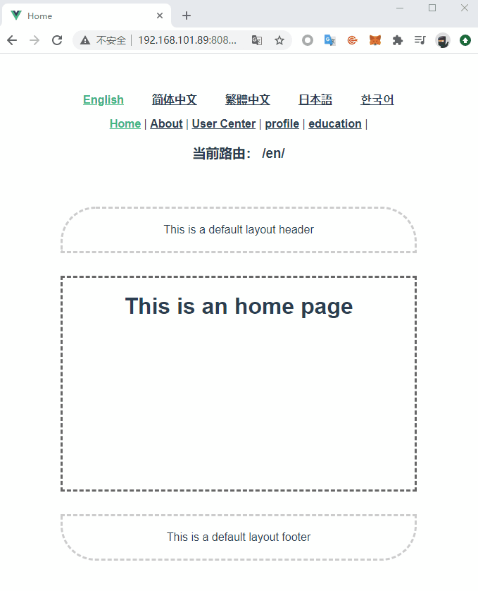

# Vue-Lang-Meta-Router

Vue router extension for scenarios with international languages and dynamic titles

:pizza: International seamless routing, asynchronous loading of translation

:violin: URL localization (short links can be customized)

:gun: Support setting the default language (there is no language prefix in the URL)

:meat_on_bone: load the last used language when you visit the website again

:cherry_blossom: dynamic update of the page title

## Install

``` sh
$ npm i vue-lang-meta-router -S
```

## Usage

``` js
// router.js or router/index.js
import {
  VueLangRouter,
  VueMetaInfo
} from 'vue-lang-meta-router'
import translations from './lang/translations'
import localizedURLs from './lang/localized-urls'

Vue.use(VueMetaInfo)

Vue.use(VueLangRouter, {
  defaultLanguage: 'en',
  translations,
  localizedURLs,
})
```

