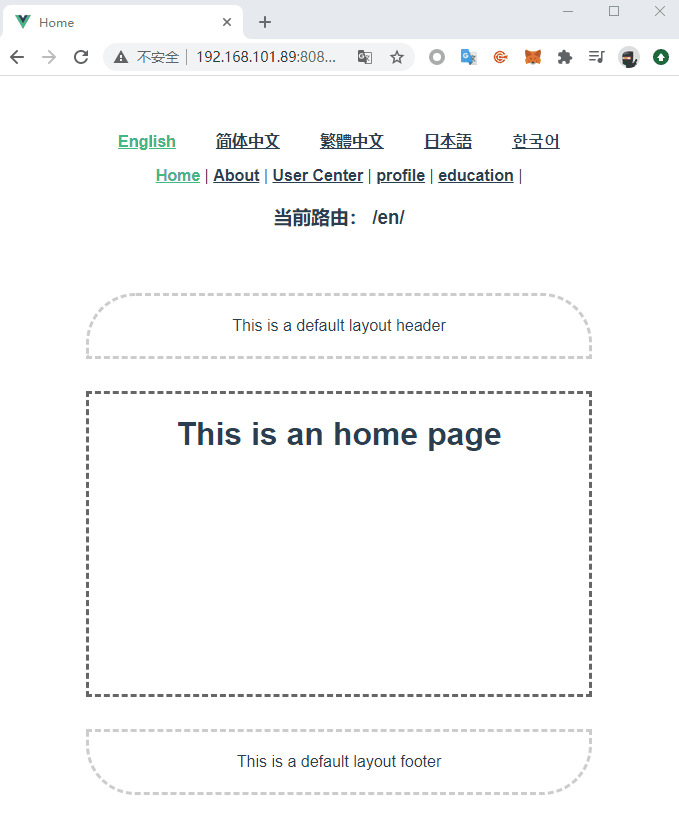

# Vue-Lang-Meta-Router

vue路由器扩展，用于国际化语言和动态标题的场景

:pizza: 国际化无缝路由，翻译异步加载

:violin: 网址本地化（可自定义短链接）

:gun: 支持设置默认语言（URL中没有语言前缀）

:meat_on_bone: 再次访问网站时加载上次使用的语言

:cherry_blossom: 网页标题动态化更新

## 安装

``` sh
$ npm i vue-lang-meta-router -S
```

## 使用

``` js
// router.js or router/index.js
import {
  VueLangRouter,
  VueMetaInfo
} from 'vue-lang-meta-router'
import translations from './lang/translations'
import localizedURLs from './lang/localized-urls'

Vue.use(VueMetaInfo)

Vue.use(VueLangRouter, {
  defaultLanguage: 'en',
  translations,
  localizedURLs,
})
```

